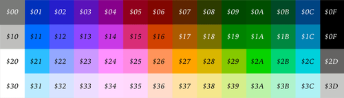

# ASM cc65 for NES dev
This repo is just a collection of information about assembly with the cc65 for the 6502 MC expected for developing NES 
games from [famicom.party](https://famicom.party/).

# Table of Contents
1. [Constants and labels](#constants-and-labels)
2. [Header interrupt vectors](header_interruptvectors.md)
3. [Refactoring](refactoring.md)
4. [The Picture Processing Unit (PPU)](ppu.md)
5. [Sprite Graphics](spritegraphics.md)
6. [Branching](branching.md)

## Constants and labels
When the assembler (ca65) is run, it will replace the name of the constant (e.g. PPUSTATUS) with its value (e.g. $2002).
You can make a constant by using the equal sign: PPUSTATUS = $2002.

Assembly also lets us set labels - named places in our code that can be referenced later. What makes a label a label is
the colon (:) that it is followed by.

## Comments
You can add comments to your assembly code using the semicolon (;) character.

## Assembler directives
Finally, assembly code gives us directives - instructions for the assembler that affect the conversion from assembly to
machine code, rather than instructions for the processor where the machine code will be executed. Directives start with
a period (.). The example code uses the .proc directive on line 1 to indicate a new lexical scope (more on that later).
Another common directive is .byte, which indicates that the following bytes should be copied raw into the machine code 
output rather than trying to process them as opcodes or operands.

## Data Movement
### Loading data: LDA, LDX, LDY
The "LD" commands load data into a register. As a reminder, the 6502 has three registers to work with: "A" or "accumulator",
which can do math, and "X" and "Y", the "index registers". LDA loads data into the accumulator, LDX loads data into the X
register, and LDY loads data into the Y register.

````asm
LDA $3f00   ; load contents of memory address $3f00
            ; into the accumulator
LDA #$3f    ; load the value $3f into the accumulator
````

### Storing data: STA, STX, STY
The "ST" opcodes do the reverse of the "LD" opcodes - they store the contents of a register to a memory address. STA
stores the contents of the accumulator to the location specified by its operand, STX stores the contents of the X register,
and STY stores the contents of the Y register. The ST instructions cannot use immediate mode, since it doesn't make sense
to store the contents of a register into a literal number. After a store operation, the register you stored from keeps its
same value, allowing you to store the same register value in a different location right away.

### Transferring data: TAX, TAY, TXA, TYA
Finally, the "T" instructions transfer data from one register to another. These opcodes are all read as "transfer from
register to register" - TAX, for example, is "transfer from accumulator to X register". The "transfer" in these instructions
is more accurately described as a "copy", since after one of these instructions, both registers will have the value of the
first register.

````asm
LDA #$a7
TAY
STY $3f00
````

## Memory-Mapped I/O
On the NES, addresses in the $2000-$6000 range are reserved for use as memory-mapped I/O (or "MMIO") addresses. "I/O" is
"input/output" - sending data between different devices. "Memory-mapped" means that these interfaces to other devices are
mapped to memory addresses - in other words, certain memory addresses are not memory at all, but rather connections to 
other devices.

Memory addresses in the low $2000s correspond to connections to the PPU. There are four MMIO addresses in use in our code;
let's take a look at what each one does (along with the name each address is commonly known by).

## $2006: PPUADDR and $2007: PPUDATA
The NES CPU (where your code is being executed) doesn't have direct access to the PPU's memory. Instead, CPU memory address 
$2006 lets your code select an address in PPU memory, and $2007 lets your code write a byte of data to that address. To set
the address you want to write to, store two bytes of data to $2006 - first the "high" (left) byte, followed by the "low" 
(right) byte.

````asm
LDX #$3f
STX $2006
LDX #$00
STX $2006
````

This code first stores the byte $3f to $2006, then the byte $00 to $2006 - in other words, it sets the address for any 
following writes to PPU memory to $3f00, which is the address of the first color of the first palette.

To store data at the selected PPU memory address, store a byte to $2007:

````asm
LDA #$29
STA $2007
````

This writes the byte $29 (which represents "green") to the memory address we selected before ($3f00). Each time you store
a byte to PPUDATA, the memory address for the next store is incremented by one. If the next lines of code in the program
were LDA #$21 and STA $2007, the byte $21 would be written to PPU address $3f01 even though we did not do anything with 
PPUADDR.

## $2002: PPUSTATUS
PPUSTATUS is a read-only MMIO address. When you load from $2002, the resulting byte gives you information about what the 
PPU is currently doing. Reading from PPUSTATUS has one useful side-effect, as well: it resets the "address latch" for 
PPUADDR. It takes two writes to PPUADDR to fully specify a memory address, and it is possible that your code might make 
one write but never get around to doing the second write. Reading from PPUSTATUS makes it so that the next write to PPUADDR 
will always be considered a "high" byte of an address.

````asm
LDX $2002
LDX #$3f
STX $2006
LDX #$00
STX $2006
LDA #$29
STA $2007
````

## $2001: PPUMASK
There's still one more thing our test project has to do after it tells the PPU to use color $29 as the first color of the 
first palette - it has to tell the PPU to actually start drawing things to the screen! PPUMASK allows your code to give 
the PPU instructions about what to draw, as well as set some tweaks to how colors are displayed. The byte that you store
to PPUMASK is a set of eight bit flags, where each bit in the byte acts as an on/off switch for a particular property.
Here is what each bit does.

| Bit # | Effect                                                |
|-------|-------------------------------------------------------|
| 0     | Greyscale mode enable (0: normal color, 1: greyscale) |
| 1     | Left edge (8px) background enable (0: hide, 1: show)  |
| 2     | Left edge (8px) foreground enable (0: hide, 1: show)  |
| 3     | Background enable                                     |
| 4     | Foreground enable                                     |
| 5     | Emphasize red                                         |
| 6     | Emphasize green                                       |
| 7     | Emphasize blue                                        |

Bits 1 and 2 enable or disable the display of graphical elements in the left-most eight pixels of the screen. Some games 
choose to disable these to help avoid flicker during scrolling, which we will learn more about later. Bits 5, 6, and 7 
allow your code to "emphasize" certain colors - making one of red, green, or blue brighter and making the other two 
colors darker. Using one of the emphasis bits essentially applies a color tint to the screen. Using all three at the 
same time makes the entire screen darker, which many games use as a way to create a transition from one area to another.

````asm
LDA #%00011110
STA $2001
````

Here is what options we are setting, bit-by-bit:

| Bit # | Value | Effect                          |
|-------|-------|---------------------------------|
| 0     | 0     | Greyscale mode disabled         |
| 1     | 1     | Show leftmost 8px of background |
| 2     | 1     | Show leftmost 8px of foreground |
| 3     | 1     | Background enabled              |
| 4     | 1     | Foreground enabled              |
| 5     | 0     | No red emphasis                 |
| 6     | 0     | No green emphasis               |
| 7     | 0     | No blue emphasis                |

The NES color palette

