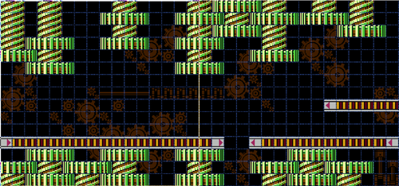
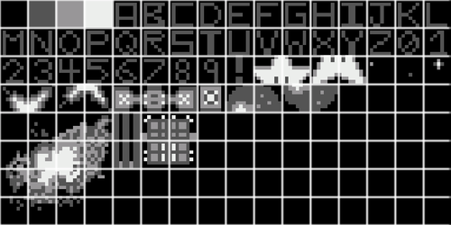
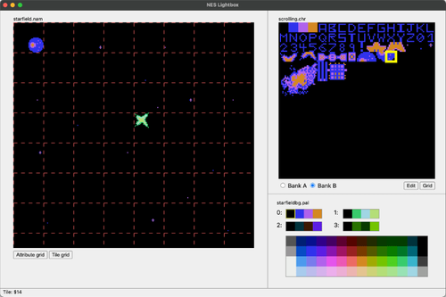
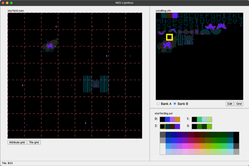
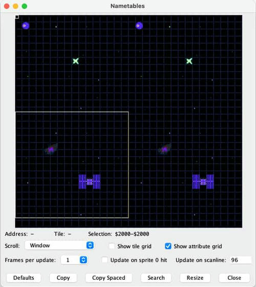

[< Back](../README.md)

## Using PPUSCROLL
In most cases, scrolling is controlled via writes to the PPUSCROLL (``$2005``) memory-mapped I/O address during Vblank 
(i.e., in your NMI handler). Your NMI handler should write to PPUSCROLL twice per frame. The first write will determine 
the X scroll position, in pixels, and the second write will determine the Y scroll position, also in pixels. Writes to 
PPUSCROLL should always occur at the end of the NMI handler (or at least after any writes to other PPU registers like 
PPUADDR), because the PPU uses the same internal registers for both memory access and scroll information, meaning writes
to other PPU registers can change the scroll position.

What the X and Y "scroll positions" mean varies based on the cartridge's nametable layout and what has been written to 
PPUCTRL. The PPU keeps track of a "current" or "base" nametable, which can be set via writes to PPUCTRL. The lowest two
bits of a byte written to PPUCTRL set the base nametable, with ``00`` representing the nametable at ``$2000``, ``01`` 
representing ``$2400``, ``10`` representing ``$2800``, and ``11`` representing $2c00. Once the base nametable has been set, the 
X and Y scroll positions are offsets from that base nametable.

Consider a standard horizontal-layout game. In this layout, there are two nametables: ``$2000`` and ``$2400``. If we set
the base nametable to ``$2000``, and set both scroll positions to zero, the resulting background image displayed on 
screen will be the entirety of the nametable at ``$2000``. Here is what that looks like:

````6502 assembly
; at end of NMI handler
LDA #$00
STA PPUSCROLL ; set X scroll
STA PPUSCROLL ; set Y scroll

````

Now let's say we want to move the "camera" twenty pixels to the right. With a horizontal layout, we would see all but 
the leftmost twenty pixels of the nametable at ``$2000`` lined up with the left edge of the screen, and the right side 
of the screen would be the leftmost twenty pixels of the nametable at ``$2400``.



Side-by-side nametables in a horizontal layout, with the attribute grid visible in blue. As the player moves to the 
right, the X scroll position increases and the viewport "slides" across the two nametables. These are the first two 
screens of the Metal Man stage in Mega Man 2.

In code, that looks like this:

````6502 assembly
; at end of NMI handler
LDA #20 ; decimal 20 because no "$"
STA PPUSCROLL ; set X scroll
LDA #$00
STA PPUSCROLL ; set Y scroll

````

What would this code do in a game that uses a vertical layout? When a scroll position is set so that the viewport would 
move beyond the bounds of the two "real" nametables, the viewport wraps around instead. However, most games do not use 
this functionality; generally, a game that uses a vertical layout will prevent horizontal scrolling and vice versa.

## Camera Systems
Now that we have seen how to scroll the background, it's time to take a look at when to scroll the background. While it
might feel natural for a character moving to the right to have the background scroll to the right with them, the NES 
leaves scrolling decisions entirely up to the programmer. Different games take very different approaches to the question
of what should trigger a scroll. These approaches represent different camera systems, each with their own advantages and
drawbacks. Let's look at a few basic techniques that were common on the NES.

## Position Locking
The simplest camera system, position locking keeps the player in the same place on screen at all times, and scrolls the 
background every time the player "moves".

Position locking is useful when the player needs a consistent view distance around their character on screen. In Micro 
Machines, which mixes high speed racing with sudden turns, the center-locked camera gives the player a clear view of 
their surroundings at all times. Similarly, in side-scrolling games, position locking on the X axis ensures that the 
player can see a fixed distance to the left and right, so they will not be surprised by enemies coming from either side.

## Camera Windows
Position-locked cameras are extremely popular on the NES, but sometimes developers want to give the player more freedom 
to move around without constantly shifting the viewport. A camera window specifies a region of the screen in which the 
player can move without causing the screen to scroll; attempting to move outside of the window causes the screen to 
scroll instead.

## Auto-scroll
Finally, the third camera system we will look at here is auto-scrolling. In an auto-scroll camera system, the player 
does not have any control over camera movement - the camera is constantly moving on its own, with the player either 
remaining in the same position while the background scrolls below or with the player sprites moving, by default, to 
match the movement of the background.

## Setting up backgrounds for scrolling
For our space shooter project, we will use a vertical layout with an auto-scrolling camera. To make our backgrounds more
interesting, I've created some additional graphics tiles and put them into a new .chr file (``scrolling.chr``).



To finish out the chapter, we will set up two nametables worth of backgrounds in a horizontal mirroring arrangement, 
and then continuously scroll across them. We will start with the "bottom" nametable taking up the full screen, slowly 
scroll upwards until the "top" nametable takes up the full screen, and then wrap around to display the bottom nametable
again.

Here is one of the nametables:



Minor additions to the nametable from last chapter, as seen in NES Lightbox.

And here is the other:



Both nametables use the same pattern of stars in the background, but with these new objects overlaid on top. To make 
things simpler, let's move our star-background-drawing code into a subroutine that we can call to draw stars for any of 
the four nametables, selected via whatever is stored in a register. I made a new file, ``backgrounds.asm``, and added 
the following subroutine:

````6502 assembly
.include "constants.inc"

.segment "CODE"

.export draw_starfield
.proc draw_starfield
  ; X register stores high byte of nametable
  ; write nametables
  ; big stars first
  LDA PPUSTATUS
  TXA
  STA PPUADDR
  LDA #$6b
  STA PPUADDR
  LDY #$2f
  STY PPUDATA

  LDA PPUSTATUS
  TXA
  ADC #$01
  STA PPUADDR
  LDA #$57
  STA PPUADDR
  STY PPUDATA

; ...and much more, see the file for full listing

  ; finally, attribute table
  LDA PPUSTATUS
  LDA #$23
  STA PPUADDR
  LDA #$c2
  STA PPUADDR
  LDA #%01000000
  STA PPUDATA

  LDA PPUSTATUS
  LDA #$23
  STA PPUADDR
  LDA #$e0
  STA PPUADDR
  LDA #%00001100
  STA PPUDATA

  RTS
.endproc

````

To use this subroutine, first store the high byte of the nametable you want to draw stars to into the X register. In our
case, since we are using horizontal mirroring, the two "real" nametables will be located at ``$2000`` and ``$2800``, so 
the value we write to the X register will be either ``#$20`` or ``#$28``. Notice that we use the Y register to load and 
store tile numbers, and the accumulator to write to ``PPUADDR``. We need to keep that base nametable byte in the X 
register because we frequently need to load it into the accumulator (with ``TXA``) and then add something to create the 
correct nametable tile address for each nametable. See, for example, lines 19-23 above. This particular byte of data 
needs to be written to either ``$2157`` or ``$2957``, depending on which nametable it is in. By using ``TXA`` followed 
by ``ADC`` ``#$01``, we get ``$21`` (if the X register had ``$20``) or ``$29`` (if the X register had ``$28``), giving 
us the correct value for both nametables.

Back in our main file, we can remove the existing "draw star background" code and replace it with two calls to our new 
subroutine:

````6502 assembly
.import draw_starfield

; inside .proc main, after writing palettes:
; write nametables
LDX #$20
JSR draw_starfield

LDX #$28
JSR draw_starfield

````

The result, if you check the "Nametables" debug helper in Nintaco, is that both nametables will have a starfield 
background. Next, we'll need to add some new objects on top of the starfield. I chose to do this in another subroutine 
inside ``backgrounds.asm``, this time called ``draw_objects``:

````6502 assembly
.export draw_objects
.proc draw_objects
  ; Draw objects on top of the starfield,
  ; and update attribute tables

  ; new additions: galaxy and planet
  LDA PPUSTATUS
  LDA #$21
  STA PPUADDR
  LDA #$90
  STA PPUADDR
  LDX #$30
  STX PPUDATA
  LDX #$31
  STX PPUDATA

  LDA PPUSTATUS
  LDA #$21
  STA PPUADDR
  LDA #$b0
  STA PPUADDR
  LDX #$32
  STX PPUDATA
  LDX #$33
  STX PPUDATA

; ...and more, not listed here

  ; finally, attribute tables
  LDA PPUSTATUS
  LDA #$23
  STA PPUADDR
  LDA #$dc
  STA PPUADDR
  LDA #%00000001
  STA PPUDATA

  LDA PPUSTATUS
  LDA #$2b
  STA PPUADDR
  LDA #$ca
  STA PPUADDR
  LDA #%10100000
  STA PPUDATA

  LDA PPUSTATUS
  LDA #$2b
  STA PPUADDR
  LDA #$d2
  STA PPUADDR
  LDA #%00001010
  STA PPUDATA

  RTS
.endproc

````

This subroutine does not collect any information from the X register (nor any other); the addresses are hard-coded. 
Calling this subroutine (with ``JSR`` ``draw_objects`` following our two calls to ``draw_starfield``) will complete our 
two nametables.



The completed nametables as seen in Nintaco's "Nametables" viewer. Note that the left and right halves are identical - 
this is because we are using horizontal mirroring. If we were to scroll to the left or right, we would move into that 
mirrored area and the screen would appear to "wrap around".

## Implementing autoscroll
As discussed previously, scroll positions get set in the NMI handler via two writes to ``PPUSCROLL``. The first write 
sets the X scroll amount (how many pixels to the right the camera window should move) and the second write sets the Y 
scroll amount (how many pixels up the camera window should move). We want our game to have the background continuously 
scroll downward, so the X scroll amount will never change (always zero) and the Y scroll amount will start at the 
maximum value and decrease every frame. Remember that while an NES screen is 256 pixels wide, it is only 240 pixels 
tall. That means we will need to start our Y scroll at 239 (the maximum value), and when we need to scroll "less than 
zero", we will need to set it back to 239 instead of doing the normal wrap around to 255.

To accomplish this, we will need two additional zero-page variables. The first, ``scroll``, will store the current Y 
scroll amount. The second, ``ppuctrl_settings``, will store the current settings that were sent to ``PPUCTRL``, so that 
we can change the base nametable every time we hit scroll position 0.

````6502 assembly
.segment "ZEROPAGE"
player_x: .res 1
player_y: .res 1
player_dir: .res 1
scroll: .res 1
ppuctrl_settings: .res 1
.exportzp player_x, player_y

````

Let's also add a new constant to ``constants.inc``, before we forget:

````6502 assembly
PPUSCROLL = $2005

````

We will need to make two changes to our ``main`` code to set things up. First, we'll need to set an initial value for 
``scroll``:

````6502 assembly
.proc main
  LDA #239   ; Y is only 240 lines tall!
  STA scroll
  
````

Second, we set ``PPUCTRL`` after drawing all of our nametables. We'll need to store the value that we send to 
``PPUCTRL`` so that we can modify and re-use it later:

````6502 assembly
LDA #%10010000  ; turn on NMIs, sprites use first pattern table
  STA ppuctrl_settings
  STA PPUCTRL
  
````

The lowest (right-most) two bits set which nametable is the "base" that scroll offsets are applied to. In this case, 
those two bits are ``00``, indicating the nametable at ``$2000``. We will need to toggle between ``$2000`` (``00``) and
``$2800`` (``10``) as the base nametable in order to have smooth scrolling. If we did not change the base nametable, you
would see a smooth scroll from one nametable to the other, but then the scroll would immediately snap back to the 
initial nametable instead of continuing to scroll smoothly.

With everything set up, let's take a look at the NMI handler, where the actual scroll positions will be set. I'll 
present the code here first and then explain it.

````6502 assembly
.proc nmi_handler
  LDA #$00
  STA OAMADDR
  LDA #$02
  STA OAMDMA
  LDA #$00

  ; update tiles *after* DMA transfer
  JSR update_player
  JSR draw_player

  LDA scroll
  CMP #$00 ; did we scroll to the end of a nametable?
  BNE set_scroll_positions
  ; if yes,
  ; update base nametable
  LDA ppuctrl_settings
  EOR #%00000010 ; flip bit #1 to its opposite
  STA ppuctrl_settings
  STA PPUCTRL
  LDA #240
  STA scroll

set_scroll_positions:
  LDA #$00 ; X scroll first
  STA PPUSCROLL
  DEC scroll
  LDA scroll ; then Y scroll
  STA PPUSCROLL

  RTI
.endproc

````

The top part of this code is unchanged from the previous example. Our new scroll code begins at line 28. Note that you 
must always set scroll positions at the end of the NMI handler, right before ``RTI``. If you set scroll positions 
earlier, other writes to PPU memory can interfere with how the PPU calculates scroll positions, leading to unexpected 
behavior.

The first thing that our new code does is check the current scroll position (``scroll``) against zero. If it is zero, 
that means we are about to wrap to a new nametable, and we will need to change the base nametable. ``BNE`` 
``set_scroll_positions`` skips the ``PPUCTRL``-setting code if ``scroll`` is not zero. Assuming that we do need to 
change the base nametable, we load the saved PPUCTRL settings and use a logical filter (``EOR``) to flip a bit to its 
opposite.

## Logical Filters
Before continuing on, let's take some time to learn about the three logical filter opcodes that the 6502 offers: ``AND``
, ``ORA``, and ``EOR``. Each opcode takes one byte as its operand, compares each bit of its operand with the 
corresponding bit of the accumulator, and changes individual bits of the value stored in the accumulator. 
Because logical filters make bit-by-bit comparisons, logical filter operands are usually expressed in binary.

AND compares each bit of its operand with the corresponding bit of the accumulator, and sets that bit of the accumulator
to ``1`` if both bits were ``1`` to begin with. Otherwise, it sets that bit of the accumulator to ``0``. Here is an 
example:

````6502 assembly
LDA #%10101010
AND #%00001111

````

After running the above code, the value in the accumulator will be ``#%00001010``. Bits one and three are set to ``1`` 
because for those bits, both the initial value in the accumulator and the value in the ``AND`` operand were ``1``. All 
other bits of the accumulator were set to zero.

``ORA`` ("OR with Accumulator") compares bit-by-bit like ``AND``, but it sets bits of the accumulator to ``1`` if either
the accumulator bit or the operand bit are ``1``. Accumulator bits are only set to zero if both accumulator and operand
bits are zero. Here is an example:

````6502 assembly
LDA #%10101010
ORA #%00001111

````

After running the above code, the value in the accumulator will be ``#%10101111``.

The final logical filter is ``EOR`` ("Exclusive OR", more commonly known as "XOR"). In logic, XOR returns "true" if 
either, but not both, of its inputs are true, and "false" otherwise. When ``EOR`` compares bits, if the bit from 
``EOR's`` operand is ``0``, the corresponding accumulator bit is not changed. If the operand bit is ``1``, the 
corresponding accumulator bit is flipped to its opposite value. Here is an example:

````6502 assembly
LDA #%10101010
EOR #%00001111

````

After running the above code, the value in the accumulator will be ``#%10100101``. The highest four bits (``1010``) 
were unchanged, because ``EOR's`` operand had zeroes there. The lowest four bits were flipped to ``0101``, because 
``EOR's`` operand had ones there.

The three logical filters allow you to make precision edits to the bits in any byte. ``AND`` allows you to filter out 
only the specific bits you care about, with ``0`` bits in its operand setting accumulator bits to zero and ``1`` bits 
allowing values from the accumulator to pass through unchanged. ORA allows you to turn bits on by using a ``1`` in its 
operand. ``EOR`` allows you to flip specific bits in the accumulator to their opposites by using a ``1`` bit in the 
operand. They take some time to learn, but they are incredibly useful and we will see them repeatedly going forward.

## Wrapping up
To return to our previous discussion, when we need to update the base nametable, we load ``ppuctrl_settings`` into the 
accumulator followed by ``EOR #%00000010``. This leaves most of the accumulator value as-is, but flips bit ``1`` 
(second from the right) to its opposite. Bits 1 and 0 of the value we send to PPUCTRL control the base nametable, with 
``00`` representing the nametable at ``$2000``, ``01`` for ``$2400``, ``10`` for ``$2800``, and ``11`` for ``$2c00``. 
By changing a single bit, we can flip between ``$2000`` and ``$2800`` as the base nametable. We then write the new value
back to ``ppuctrl_settings``, and write it to ``PPUCTRL`` as well. After changing the base nametable, we reset 
``scroll`` to 240 (not 239, because we are about to decrement it in the code that follows).

With the base nametable set, we can set the actual scroll positions. We first write a zero to ``PPUSCROLL`` to set the X
scroll amount. Then, ``DEC scroll`` subtracts one from ``scroll`` and stores the result back into ``scroll``. We load 
``scroll`` into the accumulator and then write it to ``PPUSCROLL`` to set the Y scroll amount. Having set both X and Y 
scroll amounts, we are done with the NMI handler and can call ``RTI`` to go back to main code.
