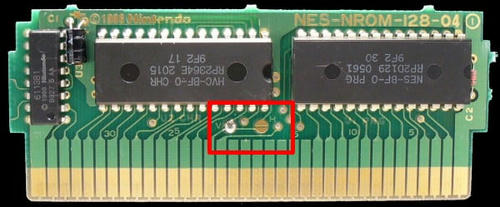
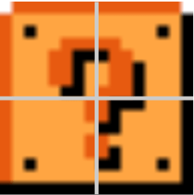

[< Back](README.md)

## Palettes
The NES uses a fixed set of 64 colors for all of its graphics.

These colors are used to fill slots in eight four-color palettes. Four palettes are used to draw background objects, and
the other four palettes are used to draw sprites, objects in the "foreground". Each thing drawn to the screen uses one
of these palettes, limiting a single graphical object to four of the 64 available colors.

## Pattern Tables
What exactly are these "graphical objects"? The NES does not let developers specify what to draw on a pixel-by-pixel 
basis. At a resolution of 256x240 pixels, each screen of graphics would require the specification of 61,440 pixels of 
color information, which would be far too much to fit into memory. Instead, the basic unit of NES graphics is the `8x8 
pixel` "tile". One screen of graphics is `32 tiles wide and 30 tiles tall` (960 tiles).

The CHR-ROM in an NES cartridge holds two pattern tables, each of which holds 256 8x8 tiles. One pattern table is used 
for background graphics, and the other is used for sprite graphics.

Each tile in the table is defined with two "bit planes", specifying which palette color (0-3) is used for each pixel of 
the tile. One bit plane defines the "low bit" of each pixel in the tile, and the other defines the "high bit". 
(Two bits, as you may recall, can represent four different values, corresponding to the four colors in a palette.) 
Each tile takes up 16 bytes of memory, so the CHR-ROM chip's 8KB of storage is just enough to fit the 512 tiles of 
the two pattern tables. By specifying only a palette index rather than an actual color, the tiles themselves take up 
less memory and can be re-used with different palettes as needed.

An example pattern table tile. Bytes `$xxx0 - $xxx7` provide the "low bit" for each pixel, and bytes `$xxx8 - $xxxf` 
provide the "high bit" for each pixel.

## Sprites
Sprites represent the "foreground" layer of graphics. Each sprite is a single tile which can be positioned anywhere on 
the screen, down to the pixel. Sprites can also be flipped vertically or horizontally (but not rotated), and each sprite
can specify which of the four sprite palettes it will use. This flexibility comes at a cost, though: memory and 
processing time constraints mean that the NES can only display 64 sprites at a time, and only eight sprites can be 
drawn on a scanline (a horizontal row of pixels).

## Backgrounds
Sprites have great flexibility at the expense of only being able to cover a small portion of the screen. Backgrounds 
have the opposite trade-off. A background can cover the entire screen — 960 8x8 tiles — but background tiles must fit
to a grid, and they suffer further limitations on palette use. The background layer can be scrolled in 1-pixel 
increments, but all the tiles move together. There is no way to scroll different parts of the screen differently without
using tricky mid-frame updates (e.g. "Sprite Zero Hit", scanline IRQ).

## Nametables
Backgrounds are defined via nametables, which live in PPU memory. Each nametable is 960 bytes, and each of those bytes
stores the tile number of one of the 256 tiles in the background pattern table. The PPU memory map has space for four 
nametables arranged in a square pattern, meaning that, in theory, you could set up four TV screens worth of background
at once.

I say in theory because the Famicom was designed to be cheap. As a compromise, the Famicom/NES has enough physical 
memory for two nametables. These are "real" nametables that behave as expected. The memory ranges for the other two 
nametables act as "mirrors" of the real nametables, so that asking for a byte of memory from a mirror returns a byte 
from the corresponding real nametable. The developer can configure which two nametables are "real" and which two are 
"mirrored". On a hardware NES cartridge, this is done with a pad of solder over one of two contacts on the cartridge 
board. For emulators, a game's mirroring setting is part of its iNES header.

The red rectangle shows the "V"/"H" contacts; whichever pair of contacts is soldered together will determine whether 
the game uses vertical or horizontal mirroring.

Mirroring can be vertical or horizontal. In vertical mirroring, nametables 1 and 2 are "real", and 3 and 4 are mirrors.
This gives the developer two screens in a left-to-right layout, perfect for horizontally-scrolling games. Horizontal 
mirroring, in contrast, makes nametables 1 and 3 the "real" nametables, and nametables 2 and 4 the mirrors. Horizontal
mirroring results in two screens in a top-to-bottom layout, which is designed for vertically-scrolling games.

> While mirroring is hard-soldered in older NES games, later cartridges that add mapper chips give the developer the 
> ability to change mirroring at any time. The MMC1 chip, for example, allows Metroid to switch between vertical and
> horizontal mirroring when the player moves through a doorway, allowing for a mix of horizontal and vertical 
> scrolling sections.

## Attribute Tables
A nametable is just a list of tile numbers. In order to color each tile with a palette, we need a second type of table.
At the end of each nametable is a 64-byte region called an attribute table, which specifies which palette to use for 
each tile of background. 960 + 64 = 1024 bytes, so each nametable / attribute table pair takes one kilobyte of memory.

Since the attribute table is only 64 bytes, there isn't enough space to specify a palette for each individual background
tile. Instead, each byte of the attribute table specifies the palette colors for sixteen background tiles, in a 
four-by-four square. Bits 0-1 of each byte specify the palette used for the top left two-by-two portion of the 
four-by-four area, bits 2-3 the top right, bits 4-5 cover the bottom left and bits 6-7 select a palette for the bottom 
right. This means that in addition to background tiles being fixed to a grid, color information is tied to its own grid
as well.

As a consequence of attribute table limitations, background objects are generally drawn in 2x2 tile units. We call 
these larger objects metatiles.

> The question mark (?) block from Super Mario Bros., an example of a metatile.

