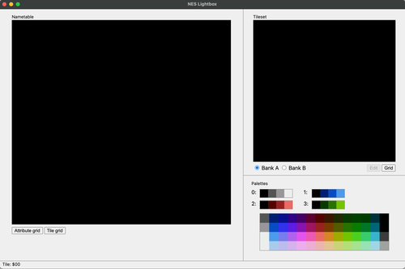

[< Back](README.md)

# Sprite Graphics
## Sprite Data
Internally, the PPU uses 256 bytes of memory to store sprite information. It takes four bytes of data to describe a 
sprite, which is where the limit of 64 sprites at a time comes from. Those four bytes of data encode the following 
information:

1. Y position of the top left corner of the sprite (0-255) 
2. Tile number from the sprite pattern table (0-255)
3. Special attribute flags (horizontal/vertical flipping, palette number, etc.)
4. X position of the top left corner of the sprite (0-255)

The third byte (attribute flags) uses its eight bits to store multiple pieces of information in a compact format. 
The eight bits control the following properties of a sprite:

| Bit # | Purpose                                    |
|-------|--------------------------------------------|
| 7     | Flips sprite vertically (if "1")           |
| 6     | Flips sprite horizontally (if "1")         |
| 5     | Sprite priority (behind background if "1") |
| 4-2   | Not used                                   |
| 1-0   | Palette for sprite                         |

## Object Attribute Memory (OAM)
The region in PPU memory where sprite data is stored is called "Object Attribute Memory", or "OAM". This region of 
memory is different in that there are special MMIO addresses that the CPU can use to update the contents of OAM all
at once, at high speed. Being able to update OAM quickly is a necessity for fast-paced games, so that all 64 sprites
can move smoothly every frame.

To use this high-speed copying, the CPU needs to have all of the sprite data ready to go in a contiguous **page** of memory.
(A page is a block of 256 bytes.) Generally, this "sprite buffer" is placed in CPU memory addresses `$0200 - $02ff`.


A common CPU memory layout for the NES. While it is possible to change where in memory some items like the stack or 
sprite buffer are located, this is the most common arrangement.

> A few things to note about the memory map image here. First, "RAM" is listed as extending from `$0300 - $0800`. In 
> reality, the entire range from `$0000 - $0800` is RAM (2KB); the region from `$0300 - $0800` is just the portion of
> RAM that is not commonly allocated for a specific purpose. The region from `$0800 - $2000` in the memory map is 
> empty space - writes to that region of memory will silently fail, and reads from that range have undefined behavior.
> Finally, note that the entire area from `$8000 - $FFFF` comes from the PRG-ROM chip on the cartridge, including the 
> six bytes that define the locations of interrupt handlers.

Within the sprite buffer (and in OAM itself), every four bytes defines one sprite. So, the first eight bytes of the 
sprite buffer look like this:

| Memory address | Purpose                                |
|----------------|----------------------------------------|
| $0200          | Y position of sprite 0 (first sprite)  |
| $0201          | Tile number of sprite 0                |
| $0202          | Attribute flags for sprite 0           |
| $0203          | X position of sprite 0                 |
|                |                                        |
| $0204          | Y position of sprite 1 (second sprite) |
| $0205          | Tile number of sprite 1                |
| $0206          | Attribute flags for sprite 1           |
| $0207          | X position of sprite 1                 |

## $2003: OAMADDR and $4014: OAMDMA
Once we have set up all of the sprite data we want to transfer, we use two new MMIO addresses in our code to send 
all of the sprite data to the PPU. `OAMADDR` is used to set where in OAM we want to write to; for all of our projects 
(and for most commercial games), this will always be `$00`, the beginning of the OAM block. `OAMDMA` initiates the 
transfer of an entire page of memory into OAM. Writing the high byte of a memory address to `OAMDMA` will transfer 
that page.

While it might seem like we only need to write to OAM when something has changed, the OAM portion of PPU memory 
is implemented with "dynamic RAM", which means that it is highly unstable and needs to be continuously refreshed, 
even if nothing has changed. In practice, this means that we want to write to OAM once per frame of graphics 
(60 times per second).

## Non-Maskable Interrupts (NMI)
Fortunately, the NES has an easy-to-use system for running code once per frame: the Non-Maskable Interrupt (NMI).
NMI is one of the three interrupt vectors the 6502 knows how to handle. The NMI event is triggered each time the 
PPU enters "vblank", which occurs at the end of each frame of graphics. "Vblank" stands for "vertical blank"; 
there is a similar "Hblank" or "horizontal blank" as well. To understand what these terms mean, we need to look 
at how the CRT televisions and monitors of the era work.

Until new technologies like plasma and LCD took over in the mid-2000's, most televisions used a technology called 
"cathode-ray tube" or CRT. CRTs work by shooting a beam of electrons through an "electron gun" to hit the inside 
of a phosphorescent screen, which absorbs the energy of the electrons and converts it into light. The electron gun
sweeps across the screen continuously in horizontal lines from top to bottom, starting at the top-left corner and 
ending at the bottom-right corner before beginning again. The speed of these sweeps is determined by the video 
signal the television is designed to display. The NTSC standard used in the US and Japan calls for 60 frames per
second, while the competing PAL standard used in Europe uses 50 frames per second.

When the electron gun is resetting itself — either to start a new horizontal line from the left edge or when 
moving from bottom right to top left to start a new frame — the stream of electrons is temporarily stopped, 
so as not to inadvertently cause graphical issues. These "blanking periods" are the only times when the display
on screen is not changing. "Hblank" occurs at the end of each horizontal line and is incredibly brief, lasting 
only 10.9 microseconds for NTSC. "Vblank" is comparatively much longer, though still short: about 1250 microseconds,
or 0.00125 seconds.

Since Vblank is one of the only times that nothing is being output to the screen, and since Hblank is
far too short to do meaningful work, it is common practice to perform most graphical updates during 
Vblank, i.e. as part of the NMI handler. Currently, the NMI handler in the test project looks like 
this:

````asm
.proc nmi_handler
  RTI
.endproc
````

RTI, as discussed previously, is the opcode for Return from Interrupt. Let's update the NMI handler to copy the memory
from `$0200 - $02ff` into OAM each time it runs:

````asm
.proc nmi_handler
  LDA #$00
  STA OAMADDR
  LDA #$02
  STA OAMDMA
  RTI
.endproc
````

On line 2, we load the literal value zero into the accumulator. On line 3, we store (write) this zero to the OAMADDR
address. This tells the PPU to prepare for a transfer to OAM starting at byte zero. Next, we load the literal value 
two into the accumulator, and write it to OAMDMA. This tells the PPU to initiate a high-speed transfer of the 256 
bytes from `$0200 - $02ff` into OAM.

In order to use OAMADDR and OAMDMA in our code, we need to update our constants file to include these new constants. 
Here is the updated constants.inc:

| Constants and its addresses |
|-----------------------------|
| PPUCTRL   = $2000           |
| PPUMASK   = $2001           |
| PPUSTATUS = $2002           |
| PPUADDR   = $2006           |
| PPUDATA   = $2007           |
| OAMADDR   = $2003           |
| OAMDMA    = $4014           |

We now have a reliable and automated way to keep OAM up to date. But where do our sprite graphics come from? The 
CHR-ROM chip in a cartridge holds two pattern tables, one for sprites and one for backgrounds. We will need to 
create our own pattern tables to display sprites on screen. This is where NES Lightbox comes in handy.

## Using NES Lightbox

The main screen of NES Lightbox.

The right half of the interface is broadly divided into pattern tables ("Tileset") and palettes.


Within the "Tileset" area, the main element is a display of a pattern table. Just below the pattern table display 
are toggle switches for "Bank A / Bank B". As mentioned before, generally one pattern table is used for sprites, 
and the other is used for backgrounds. The A/B switch lets you flip between the two pattern tables. There is also
a "Grid" button, which will turn on and off a grid showing the boundaries of each tile in the pattern table. The 
"Edit" button will open a separate tile editor window once you select a tile in the tileset display.


The "Palettes" area lets you preview how different palette choices will affect your tiles. There are four numbered 
palettes. Clicking any color will change the display of the sprites in the pattern table to the palette that color
is part of. You can change a color by clicking a color in a palette, then choosing a color from the display of all 
possible colors at the bottom of this section. Hovering over any color in the pop-up will display the hexadecimal
value the NES uses for that color, to use in your code.

> Changing the first color of any palette in the palettes area will change the background color of the large canvas 
> area as well as the background of the pattern table display.

## Making Your Own Tiles
Open `graphics.chr` in **NES Lightbox**. To edit or create tiles, click on the space in the pattern table display for the
tile you wish to alter, then click the "Edit" button. This will open a separate tile-editing window.


> Note that clicking on different palettes in the main window changes all displayed colors to the colors from that 
> palette. This is extremely useful for testing out what your tiles will look like in the palettes used by your game.

To edit a tile (or create new tiles!), select a palette index from the four colors below the tile, then click pixels
in the Edit Tile window to set them to that palette index. The "Grid" button will turn on a dotted-line grid that 
makes it easier to see where each individual pixel of the tile is. The rotate and flip buttons allow you to easily
make large-scale edits. Once you have created a set of tiles to work with, save your work.

## Displaying Sprites In Your Game
In order to display our tiles in a game, we first need to make sure we load the .chr file that contains them. Change 
the .segment "CHR" section to this:

````asm
.segment "CHR"
.incbin "graphics.chr"
````

.incbin, as you might expect, is a new assembler directive that instructs ca65 to include raw binary
data (as opposed to .include, which is processed by the assembler). With our tiles in place, it's 
time to draw something. Here, we will use the four "spaceship" tiles from graphics.chr, but feel
free to use your own tiles instead.

Next, we will need to fill out an entire palette, instead of just setting the first palette color 
to green ($29). We'll extend .proc main as follows:

````asm
.proc main
    ; write a palette
    LDX PPUSTATUS
    LDX #$3f
    STX PPUADDR
    LDX #$00
    STX PPUADDR
    LDA #$29
    STA PPUDATA
    LDA #$19
    STA PPUDATA
    LDA #$09
    STA PPUDATA
    LDA #$0f
    STA PPUDATA
.endproc
````

> Notice that we only have to set an address with PPUADDR once; each time we write to PPUDATA, the PPU memory address 
> is automatically increased by one.

Next, we need to store the data for our sprites. We are going to start by drawing one sprite, the top-left "corner"
of the spaceship. As discussed earlier, we will store all our sprite information in memory between $0200-$02ff, and
copy it to the PPU using DMA transfer (in our NMI handler).

````asm
...
    ; write sprite data
    LDA #$70
    STA $0200 ; Y-coord of first sprite
    LDA #$05
    STA $0201 ; tile number of first sprite
    LDA #$00
    STA $0202 ; attributes of first sprite
    LDA #$80
    STA $0203 ; X-coord of first sprite
...
````

Finally, we need to make one more change to `.proc main`. We turn on the screen by writing to PPUMASK. However, 
now that we are using the NMI handler, we need to tell the CPU to generate NMI events. We can do that by writing 
to PPUCTRL, like this:

````asm
vblankwait:       ; wait for another vblank before continuing
    BIT PPUSTATUS
    BPL vblankwait
    
    LDA #%10010000  ; turn on NMIs, sprites use first pattern table
    STA PPUCTRL
    LDA #%00011110  ; turn on screen
    STA PPUMASK
````

At this point, our code will draw a single sprite (the top-left of the spaceship) to the screen, at X $80 and Y $70
(near the middle of the screen). The sprite data that we wrote to CPU memory between $0200-$02ff will be copied to
PPU memory once per frame by our NMI handler.